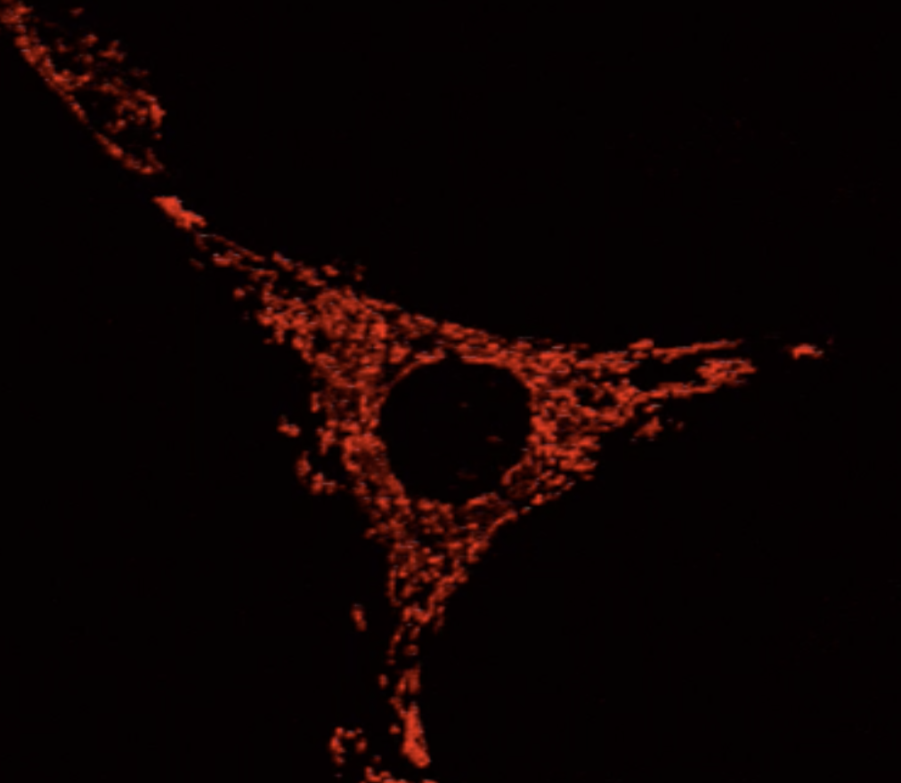

# OrNet [](https://travis-ci.org/quinngroup/ornet)
Tracking *diffuse* organelles presents more challenges than just characterizing movement– their structures morph into/out of each other much more fluidly than discrete cells. Structural changes in organelles can offer key insight into cellular proccesses. **OrNet** is a Python pipeline for analyzing fluorescence microscopy imagery of mitochondrial protein patterns. 




*Mitochondria in a single cell, with red flourescent tagging* 

# Dependencies
**Required packages:** scipy, numpy, matplotlib, opencv, itk, cython,
joblib, imageio, scikit-image, scikit-learn, imageio-ffmpeg,
opencv-python>=4

**Python version:**
Python >= 3.7

# Installation
Inside of the root directory of this project run either

```pip install .``` or ```python setup.py install```

This installation process should install all of the required dependencies.
In the event that some of the packages are not installed properly,
please refer to the dependencies section and manually install all that are listed.

# Testing
Inside of the "tests" sub-directory, run the following command:

```
python ornet_tests.py
```

7 tests, from various checkpoints along the pipeline, should run without any failures.

# Usage
Ornet can be utilized by calling the Pipeline module from either the command line interface or in a script.
Pipeline will output a directory of the following structure:

```
├── outputs/
│   ├── singles/
│   ├── intermediates/
│   ├── distances/
```

The singles sub-directory will contain the individual videos (.avi) of each extracted cell from the original video, 
intermediates contain compressed numpy files (.npz) that store the means, covariances, weights, and precisions
matrices generated by the gaussian mixture model (GMM) in the pipeline, and the distances directory contains numpy files (.npy)
that represent the divergence metrics between components of the GMM.

## Command Line Interface:
```
python -m ornet.Pipeline -i <input video or directory> -m <mask directory> -o <output directory>
```

For more detailed information regarding command line options the "-h" flag can be utilized

```
python -m ornet.Pipeline -h
```

## Python script:
```
from ornet import Pipeline as pipeline

pipeline.run(input_path, mask_path, output_path)
```

# Requests, Queries, or Issues
In case of any requested changes, questions, or issues related to this source code please create an issue here.

# Publications
If you are using OrNet in a scientific paper, please see the following publications:

[Dynamic Social Network Modeling of Diffuse Subcellular Morphologies](https://conference.scipy.org/proceedings/scipy2018/Andrew_Durden.html)

[Modelling Diffuse Subcellular Protein Structures as Dynamic Social Networks](https://arxiv.org/abs/1904.12960)

