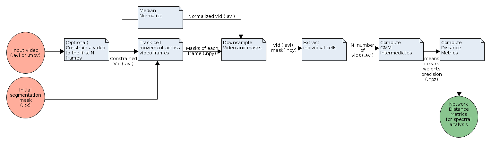

# OrNet [](https://travis-ci.org/quinngroup/ornet)  [](https://joss.theoj.org/papers/6fbce182256576a0dd3d35c26f83a9ef)
**OrNet** is a python pipeline for analyzing fluorescence microscopy imagery of mitochondrial protein patterns. 


*Mitochondria in a single cell, with red flourescent tagging* 

## Purpose
Analyzing the morphological changes organelles undergo after exposure to external stimul is significant because some structures offer crucial insight into the manner in which human cells responds to viral or bacterial infections. This framework is intended to mitigate the need for manual inspection of flouresence microscopy videos to identify time points and frame regions where significant changes are occurring. Our framework is defined by three key components -- cell segmentation, graph construction, and spectral analysis.

## Dependencies
**Required packages:** 
The complete list of required packages are described in the [requirements.txt](https://github.com/quinngroup/ornet/blob/master/requirements.txt) file.

**Python version:**
This software has been tested on python versions 3.6 - 3.8.

## Installation
Inside of the root directory of this project run:

```
pip install -r requirements.txt
pip install .
```

This installation process should install all of the required dependencies.
In the event that some of the packages are not installed properly,
please refer to the dependencies section and manually install all that are listed.

## Testing
Inside of the "tests" sub-directory, run the following command:

```
python tests.py
```

7 tests, from various checkpoints along the pipeline, should run without any failures.

## Pipeline Outline



**Inputs:**
OrNet accepts as input 

The pipeline is composed of 7 tasks:

1. Constraining the video (Optional)
2. Tracking cell movements
3. Median Normalize each video frame
4. Downsampling the video (Optional)
5. Extract individual cells
6. Computing GMM intermediates
7. Computing distance metrics

**Outputs**:
The pipeline will output a directory of the following structure:
```
├── outputs/
│   ├── singles/
│   ├── intermediates/
│   ├── distances/
```

The singles sub-directory will contain the individual videos (.avi) of each extracted cell from the original video, 
intermediates contain compressed numpy files (.npz) that store the means, covariances, weights, and precisions
matrices generated by the gaussian mixture model (GMM) in the pipeline, and the distances directory contains numpy files (.npy) that represent the divergence metrics between components of the GMM.

## Usage

Ornet can be utilized from either the command line interface or in a script.

**Command Line Interface:**
```
python -m ornet -i <input video or directory> -m <mask directory> -o <output directory> -c <constrain count>
```

For more detailed information regarding the command line options, use the "-h" flag.

```
python -m ornet -h
```

**Python script:**
```
from ornet import pipeline as pipeline

pipeline.run(input_path, mask_path, output_path)
```

## Community Guidelines
### Requests or Questions
For any questions or change requests related to this project, please create an issue [here](https://github.com/quinngroup/ornet/issues). We ask that you use labels, such as "feature request" or "question", when creating an issue.

### Reporting Issues
If you experinece any unexpected behavior with this software, please document it using this repository's [issues](https://github.com/quinngroup/ornet/issues) section. Please tag issues of this nature with the "unexpected behavior" label.

**Documentation Process**
1. Post a concise description of the unexpected behavior.
2. Include a small code snippet that can reproduce the behavior.
3. Describe the results of the snippet.
4. Detail the expected results of the snippet.

### Issue Solutions
If you would like to submit a code fix for our developers to review, complete the following steps:
1. If an issue does not already exist for this problem, create one according to the above documentation process.
2. Fork the project.
3. Apply your changes.
4. Create a pull request, and include in the request a reference to the issue.

## Publications
If you are using OrNet in a scientific paper, please see the following publications:

[Dynamic Social Network Modeling of Diffuse Subcellular Morphologies](https://conference.scipy.org/proceedings/scipy2018/Andrew_Durden.html)

[Modelling Diffuse Subcellular Protein Structures as Dynamic Social Networks](https://arxiv.org/abs/1904.12960)

