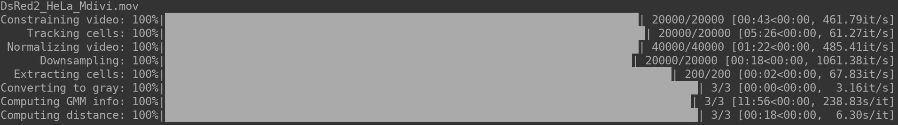

# OrNet [](https://travis-ci.org/quinngroup/ornet)  [](https://joss.theoj.org/papers/6fbce182256576a0dd3d35c26f83a9ef)
**OrNet** is a python pipeline for analyzing 
microscopy imagery of organelles. 


*Mitochondria in a single cell, with red flourescent tagging* 

## Purpose
Analyzing the morphological changes organelles undergo after exposure to external stimuli is significant because some structures offer crucial insight into the manner in which human cells responds to viral or bacterial infections. This framework is intended to mitigate the need for manual inspection of fluorescence microscopy videos to identify time points and frame regions where significant changes are occurring.

## Dependencies
**Required packages:** 
The complete list of required packages are described in the [requirements.txt](https://github.com/quinngroup/ornet/blob/master/requirements.txt) file.

**Python version:**
This software has been tested on python versions 3.6 - 3.8.

## Installation
Inside of the root directory of this project run:

```
pip install -r requirements.txt
pip install .
```

This installation process should install all of the required dependencies.
In the event that some of the packages are not installed properly,
please refer to the dependencies section and manually install all that are listed.

## Testing
Inside of the *tests* sub-directory, run the following command:

```
python tests.py
```

7 tests, from various checkpoints along the pipeline, should run without any failures.

## Pipeline Outline


**Concept:**

Inspired by social networks, OrNet models the dynamic morphologies of organelles as social network graphs. Just as Twitter and Facebook capture the dynamic nature of interpersonal relationships through the establishment or dissolution of connections between individuals, OrNet creates graphs that capture the spatio-temporal relationships of organellar structures via a similar edge management process. Graphs are constructed by fitting gaussian mixture models to every frame in a video; the final means become the vertices, while a divergence metric is applied to every combination pair of mixture components to create the edges. Once graphs are created for each frame, spectral decomposition can be utilized to track the leading eigenvalues to understand the time-points and frame regions where the organellar structures are demonstrating significant changes.      

**Inputs:**

- A single time-series video where the cells are fluorescently tagged to aid in the detection of sub-cellular organisms. (Note: We used a red fluorescent protein, DsRed2-Mito-7, in our experiments.)  
- An initial segmentation mask that denotes the location of each cell in the first frame, saved in the (.itk) format. (Documentation for the ITK-Snap tool we used to generate our masks can be found [here](http://www.itksnap.org/pmwiki/pmwiki.php?n=Documentation.SNAP3).)

The **pipeline** is composed of 7 tasks:

1. Constraining the video (Optional)

   Truncates video frames after a specified number. This is optional, but useful, because in some time-lapse videos cells        stop moving after a period of time.  
   
2. Tracking cell movements
   
   Generates segmentation masks for every frame in the video, using the initial mask a a starting point. This is a necessary    step since cells move over time and the segmentation masks need to be updated accordingly.

3. Median Normalize

    Normalizes every frame in a video to minimize the effects lighting conditions may have had when constructing the videos. 

4. Downsample the video and masks (Optional)

    Skip a given number of frames in the both the video and masks to generate a smaller video. This is useful for videos         where cells slowly move over time, thus not any significant change is detected between many of the frames. 

5. Extract individual cells

   Separate each cell found in the input video into their own videos using the segmentation masks generated from tracking the    cells movement. This is an important step in the pipeline because the framework constructs a graph to model a specific        organellar structure in single cell. Problems may arise if multiple cells are present in a frame because graph edges          may be constructed between organelles in different cells, so to prevent this each cell is extracted.

6. Computing GMM intermediates

   Regions of interests, or intensisty peaks, a found within the first frame of the video and those locations are considered    the initial component means for the guassian mixture model (GMM). The pixel intensity variances around those regions          become the initial covariances, while the normalized pixel intensities found at the location of each mean is considered to    be the initial weights. Subsequently, the GMM is fit according to each frame, and the final means, covariances, weights,      and precisions are saved. The final means are considered the vertices in the graph. 

7. Computing distance metrics
  
   A distance metric is applied to every combination pair of distributions from the GMM. The distances serve as edge            weights between vertices in the graph.  

**Outputs**:

The output will be a directory of the following structure:
```
├── outputs/
│   ├── singles/
│   ├── intermediates/
│   ├── distances/
```

The singles sub-directory will contain the individual videos (.avi) of each extracted cell from the original video, 
intermediates contain compressed numpy files (.npz) that store the means, covariances, weights, and precisions
matrices generated by the gaussian mixture model (GMM), and the distances directory contains numpy files (.npy) that represent the divergence metrics between components of the GMM.

Note: The pipeline generates temporary files that are deleted upon completion of all tasks. In our experiments, we noticed that our videos comprised of around 20,000 frames used approximately 3.5GB of disk space for the temporary files. The final output directory size was approximately 4MB. Ultimately, we expect the amount temporary space needed will grow proportionally with the size of input video.  

## Usage

OrNet can be utilized from either the command line interface or in a script.

**Command Line Interface:**
```
python -m ornet -i <input video or directory> -m <mask directory> -o <output directory> -c <constrain count> -d <downsample count>
```

For more detailed information regarding the command line options, use the "-h" flag.

```
python -m ornet -h
```

**Python script:**
```
from ornet import pipeline as pipeline

pipeline.run(input_path, mask_path, output_path)
```

## Example

Included in the *samples* directory are two types of fluorescent microscopy videos, llo and mdivi, that we utilized in our experiments to model mitochondria. LLO refers to the pore-forming toxin listeriolysin O, while mdivi refers to mitochondria division inhibitor-1. These proteins were introduced to cause fragmentation and hyperfusion, respectively. Below is a typical usage of OrNet to generate social network graphs of the mitochondria, using the mdivi sample.

```
python -m ornet -i samples/mdivi/ -m samples/mdivi/ -c 20000 -d 100 -o ~/Desktop
```
To demonstrate the usage of the constrain count option ("-c") we supplied as an argument the value "20,000", so only the first 20,000 frames are utilized. Likewise, we demonstrated the downsample option by supplying the value "100", which produces a new video and segmentation mask array comprised of every 100th frame from the video and masks. 



A console output similar to the one above is expected for a successful run of OrNet. (Note: Cell tracking and GMM computations generally take the longest amount of time. If any progress bar appears to have stopped, please be patient while OrNet finishes that task.)

## Community Guidelines
### Requests or Questions
For any questions or change requests related to this project, please create an issue [here](https://github.com/quinngroup/ornet/issues). We ask that you use labels, such as *feature*, *request*, or *question*, when creating an issue.

### Reporting Issues
If you experience any unexpected behavior with this software, please document it using this repository's [issues](https://github.com/quinngroup/ornet/issues) section. Please tag issues of this nature with the "unexpected behavior" label.

**Documentation Process**
1. Post a concise description of the unexpected behavior.
2. Include a small code snippet that can reproduce the behavior.
3. Describe the results of the snippet.
4. Detail the expected results of the snippet.

### Issue Solutions
If you would like to submit a code fix for our developers to review, complete the following steps:
1. If an issue does not already exist for this problem, create one according to the above documentation process.
2. Fork the project.
3. Apply your changes.
4. Create a pull request, and include in the request a reference to the issue.

## Publications
If you are using OrNet in a scientific paper, please see the following publications:

[Dynamic Social Network Modeling of Diffuse Subcellular Morphologies](https://conference.scipy.org/proceedings/scipy2018/Andrew_Durden.html)

[Modelling Diffuse Subcellular Protein Structures as Dynamic Social Networks](https://arxiv.org/abs/1904.12960)
